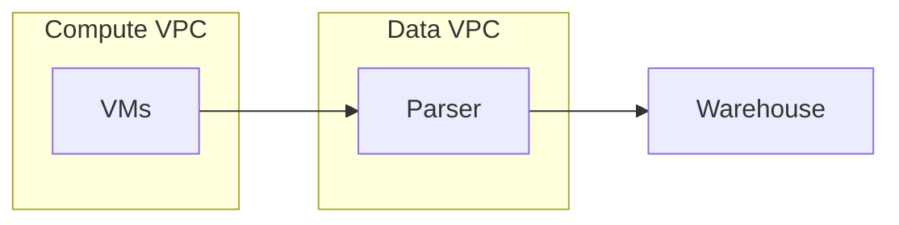

# hashi-acme

## Demos

1. Terraform Code / Modules in VCS
    - Compute with VPCs
    - use module for VMs?

2. Creation of Workspaces
    - Terraform cloud?

3. Use of Terraform CLI / Open Source against remote backend workspace (show headless mode?)
    - [Setup for gcs](https://developer.hashicorp.com/terraform/language/settings/backends/gcs)

4. How different teams can collaborate
    - Show examples of multi-operator model and how it can quickly evolve. BUT give the company options.

5. Provisioning to one or more clouds or services
    - GCP example and show how it would look for DigitalOcean
    - Think of Terraform as your Google Maps or Waze of the IaC. With google maps, it doesn't matter that I don't know the roads or even if it's a completely foreign country. I can effectively navigate.

## Rough Architecture

